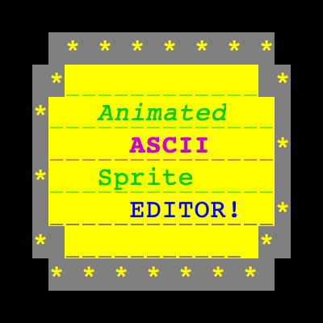

# _Animated_ ASCII Sprite Editor




A modern, desktop-based ASCII art animation editor built with Electron, TypeScript, and Vite. Refactored for robust performance and a type-safe developer experience.

## Features

- **Character-Based Editing**: Draw animations using standard ASCII characters.
- **Dynamic Resizing**: Change canvas dimensions on the fly without losing data.
- **Animation Playback**: Preview your animations with adjustable frame durations.
- **Frame Management**: Insert and navigate through multiple frames via a vertical selector.
- **Color Control**: Set foreground and background colors for individual cells.
- **Export**: Save your sprite data as JSON for integration into other projects.

## Installation

### Mac

Check out releases: https://github.com/smikulcik/ascii-sprite-editor/releases

- [ascii-sprite-editor-v1.0.0 DMG](https://github.com/smikulcik/ascii-sprite-editor/releases/download/v1.0.0/ascii-sprite-editor-1.0.0.dmg)

### Windows/Linux

I haven't figured out how to persuade electron-builder to create a working installer for Windows and Linux. TBD/

For now, just clone the repo and run locally:

```bash
git clone https://github.com/smikulcik/ascii-sprite-editor.git
cd ascii-sprite-editor
npm install
npm start
```

## Development

- **Linting**: `npm run lint` (ESLint 9 + Prettier)
- **Type Checking**: `npm run type-check` (tsc)
- **Agentic Interaction**: See [AGENTS.md](./AGENTS.md) for guidelines on how AI agents interact with this codebase.

## Project Structure

```text
├── src/
│   ├── main/          # Electron Main Process (Lifecycle, Windows)
│   ├── preload/       # Electron Preload Script (Security, IPC)
│   └── renderer/      # Frontend Application (TypeScript + CSS)
│       ├── editor.ts      # Main Canvas & Interaction logic
│       ├── sprite.ts      # Core Data Structures & Resizing
│       ├── frame-selector.ts # Preview & Navigation
│       └── index.ts       # Entry Point & UI Event Handling
├── index.html         # Application Shell
├── electron.vite.config.ts # Build Configuration
└── tsconfig.json      # TypeScript Configuration
```

## License

ISC
